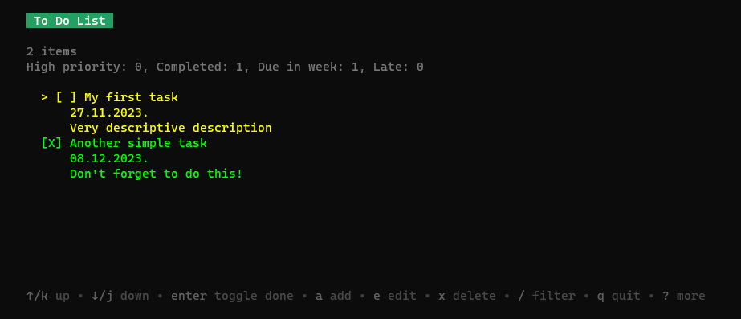

# Task Manager in Go
## PL Homework 6
### Martins P, BITL4

Very simple task manager that fulfills basic CRUD functionality, stores data in SQLite and offers filtering and some statistics. Available operations are indicated at the bottom of the task list.

GUI made using [Bubble Tea](https://github.com/charmbracelet/bubbletea) and [Reactea](https://github.com/londek/reactea). Their examples and docs heavily used in creation of this app.

